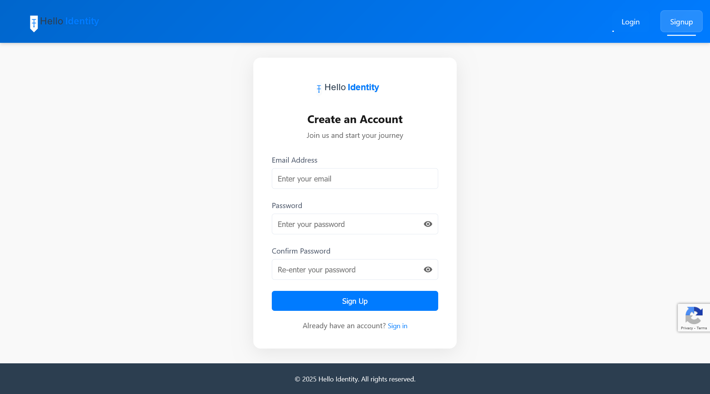
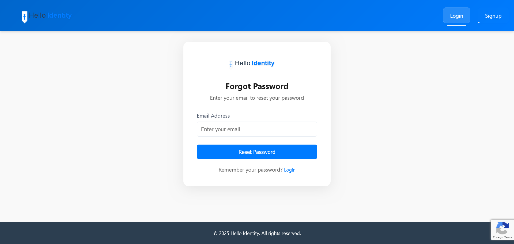

# Hello Identity

A scalable authentication service built with NestJS


## Description

Hello Identity is a comprehensive authentication service designed to provide secure user authentication and identity management features. It's built on NestJS and offers a robust set of authentication capabilities including local authentication, social logins, email verification, and token management.

## Features

- **User Authentication**

  - Local authentication with email and password
  - OAuth integration with Google and GitHub
  - JWT-based authentication
  - Refresh token mechanism

- **User Management**

  - Registration with email verification
  - Password reset and recovery flow
  - User permissions (detailed below)

- **Security Features**

  - CSRF protection
  - Google reCAPTCHA integration
  - Token-based authentication
  - Secure password storage

- **Multi-Client Support**
  - Configurable for multiple client applications
  - Token management across different clients
  - Customizable redirect flows

## Tech Stack

- **Backend**: NestJS with TypeScript
- **Database**: PostgreSQL with TypeORM
- **Caching**: Redis
- **View Engine**: Handlebars (HBS)
- **Authentication**: Passport.js with JWT
- **Security**: CSRF protection, Google reCAPTCHA
- **Email**: Mailjet integration
- **Documentation**: Swagger API docs

## Prerequisites

- Node.js (version specified in .nvmrc)
- Docker and Docker Compose (for PostgreSQL and Redis)
- npm

## Installation and Setup

### 1. Clone the repository

```bash
git clone https://github.com/JospenWolongwo/hello-identity.git
cd hello-identity
```

### 2. Set up environment variables

Create a `.env` file by copying the `.env.example` file:

```bash
cp .env.example .env
```

Update the environment variables in the `.env` file based on your configuration needs. Key variables include:

- Database credentials
- Redis configuration
- JWT secrets and expiration times
- reCAPTCHA keys
- Mail configuration
- Client URLs

### 3. Start the database and cache services with Docker

```bash
docker-compose up -d
```

This will start:

- PostgreSQL database
- pgAdmin (database management UI)
- Redis cache

### 4. Install dependencies

```bash
npm install
```

### 5. Initialize the database (optional)

To initialize the database with seed data:

```bash
npm run reseed
```

## Running the Application

### Development Mode

To start the application in development mode with automatic reload:

```bash
npm run start:dev
```

This will:

1. Clean the dist directory
2. Copy view templates and static assets
3. Watch for changes and rebuild automatically
4. Start the NestJS server in watch mode

### Production Mode

To build and run the application in production mode:

```bash
npm run start:prod
```

This will:

1. Build the application
2. Copy assets
3. Start the application in production mode

### Debug Mode

To run the application in debug mode:

```bash
npm run start:debug
```

## API Documentation

Once the application is running, you can access the Swagger API documentation at:

```text
http://localhost:3000/api
```

### Permission Endpoints

The application provides several endpoints for managing user permissions:

#### User Permission Management

- **Add Permissions**: `POST /permissions/:id`
  - Adds specific permissions to a user
  - Requires `AddPermissions` permission
  - Body: `{ "permissions": ["permission1", "permission2"] }`

- **Revoke Permissions**: `DELETE /permissions/:id`
  - Revokes specific permissions from a user
  - Requires `RevokePermissions` permission
  - Body: `{ "permissions": ["permission1", "permission2"] }`

#### Permission Retrieval

- **Get User Permissions**: `GET /permissions/user/:id/:appName`
  - Retrieves a user's permissions for a specific application
  - Requires `ReadUsers` permission

- **Get My Permissions**: `GET /permissions/my/:appName`
  - Retrieves the currently authenticated user's permissions for a specific application

- **Get App Permission Values**: `GET /permissions/app/:appName/values`
  - Retrieves all available permission values for a specific application

- **Get App Permissions**: `GET /permissions/app/:appName`
  - Retrieves the permission structure for a specific application
  - Used for UI permission assignment

## Permission Configuration

The application supports a flexible permission system loaded from a JSON configuration file:

1. Permission definitions are stored in `permissions.json` at the root of the project
2. Permissions are organized by application name (e.g., `helloHardware`, `hermes`)
3. Each application can define categories of permissions (e.g., `user`, `permission`)
4. Each category contains an array of specific permission values

Example permissions.json:

```json
{
  "helloHardware": {
    "user": ["ReadUsers", "CreateUser", "UpdateUser", "DeleteUser"],
    "permission": ["AddPermissions", "RevokePermissions"]
  },
  "hermes": {}
}
```

## Screenshots

### Desktop Views

#### Sign Up



#### Sign In


#### Forgot Password



### Mobile View


## Contact

- **Developer**: Jospen Wolongwo
- **Email**: [jospenwolongwo@gmail.com](mailto:jospenwolongwo@gmail.com)
- **Website**: [jospenwolongwo.com](https://jospenwolongwo.com)
- **GitHub**: [JospenWolongwo](https://github.com/JospenWolongwo)

## User Interface

The application provides several web pages for user authentication:

- Login page: `/auth/login`
- Sign up page: `/auth/signup`
- Password reset: `/auth/forgot-password`
- Email confirmation: `/auth/confirm-email?token=<activation-token>`

## Multi-Client Configuration

The application supports multiple client applications. To configure:

1. Update the `CLIENTS` environment variable with client names and URLs
2. For redirects, use format: `client1cli/redirect/path`
3. The `CLIENT_DELIMITER` (default: `cli`) separates client name from path

## Troubleshooting

- **Database Connection Issues**: Ensure the PostgreSQL container is running and the credentials in `.env` match
- **Redis Cache Issues**: Verify Redis container is running and accessible
- **Authentication Errors**: Check JWT secrets and expiration settings in `.env`
- **Email Delivery Problems**: Validate Mailjet API credentials and sender configuration
